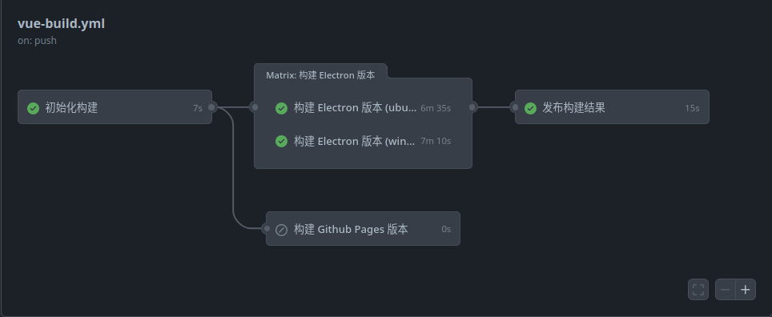
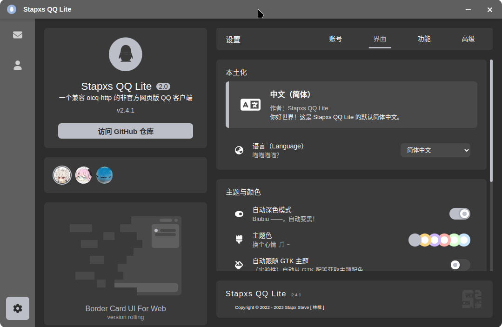
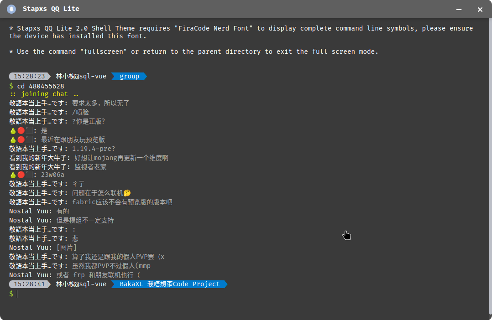

<p align="center">
  <a href="https://blog.stapxs.cn" target="blank">
    
  </a>
  <h2 align="center" style="font-weight: 600">Stapxs QQ Lite 2.0</h2>

  <p align="center">
    一个兼容 oicq-http2 的非官方网页 QQ 客户端
    <br />
    <a href="https://stapxs.github.io/Stapxs-QQ-Lite-2.0/" target="blank"><strong>🌎 访问 DEMO</strong></a>&nbsp;&nbsp;|&nbsp;&nbsp;
    <a href="https://github.com/Stapxs/Stapxs-QQ-Lite-2.0/releases" target="blank"><strong>📦️ 下载程序</strong></a>&nbsp;&nbsp;|&nbsp;&nbsp;
    <a href="https://github.com/Stapxs/Stapxs-QQ-Lite-2.0/issues/new?assignees=Stapxs&labels=%3Abug%3A+%E9%94%99%E8%AF%AF&template=----.md&title=%5B%E9%94%99%E8%AF%AF%5D" target="blank"><strong>💬 反馈问题</strong></a>
    <br />
    <br />
    <strong>本网页应用仅供学习交流使用，请勿用于其他用途</strong><br>
    <strong>版权争议请提出 issue 协商</strong>
  </p>
</p>


## ✨ 特性支持
- ✅ 使用 Vue.js 全家桶开发，快乐前后端分离
- 🎨 自适应布局，竖版也能使用
- 🖥️ 支持 PWA（都有 Electron 了（小声））
- 🌚 Light/Dark Mode 自动切换
- 🍱 该有的都有（虽然比不过官方端）
  - 复杂消息显示、转发、回复、撤回
  - 群文件、群公告、群设置（一小部分）、精华消息
  - 图片、收藏表情、文件发送
- 📦️ 支持多种 bot，我就是要用！
- 🔥 水生火热但是更好看的 Electron 客户端
- 🥚 彩蛋！来更多的彩蛋！
- 🛠 更多特性开发中

## ♿️ 快速使用
### > 运行服务
Stapxs QQ Lite 需要一个 QQ Bot 后端提供服务，你可以参考 [📖 这个文档](https://github.com/Stapxs/Stapxs-QQ-Lite-2.0/wiki/%E8%BF%9E%E6%8E%A5-oicq2-http) 布置它。

### > 访问应用
本仓库开启了 GitHub Pages, 所有向主分支提交的代码将会自动构建并发布。你可以直接访问 [🌎 这个页面](https://stapxs.github.io/Stapxs-QQ-Lite-2.0) 来使用已经构建并部署的页面。

### > 安装应用
除了直接使用本仓库的构建页面，你也可以下载使用 electron 打包的功能**稍稍**更丰富的客户端版本，访问 [📦️ 这儿](https://github.com/Stapxs/Stapxs-QQ-Lite-2.0/releases) 查看构建列表。

## 💬 提醒和问题

### > 关于不安全连接
- 当使用 https 页面连接 ws 服务（反之相同）的情况下，连接将会失败；这是由于其中某一者是不安全的。在这种情况下，你可以选择将 ws 提升为 wss 或者将 https 降级为 http（不安全）来解决问题，此处不提供解决方案。>> [Stapxs-QQ-Lite#32](https://github.com/Stapxs/Stapxs-QQ-Lite/issues/32)

### > 我能使用其他 QQ Http Bot 吗

- 如果它兼容 [OneBot 11 协议](<https://github.com/botuniverse/onebot-11>), 你可以尝试连接它, 但是由于消息体格式和接口扩展的差异，大部分情况下都不能完全正常使用。
  已经兼容的 Bot 都写在了文档里，可以去 [这里](https://github.com/Stapxs/Stapxs-QQ-Lite-2.0/wiki) 查看。

### > 使用 Bot 是否有风险

- 如果你使用的是 oicq-http, 可以查看此处了解 [使用风险](<https://github.com/takayama-lily/oicq/wiki/98.%E5%85%B3%E4%BA%8E%E8%B4%A6%E5%8F%B7%E5%86%BB%E7%BB%93%E5%92%8C%E9%A3%8E%E6%8E%A7>), 如果你尝试使用其他 QQ Bot (参见上一条问题), 请自行参考它的文档。

### > 我遇到了问题

- 如果有什么奇奇怪怪的问题, 欢迎发起 [issue](<https://github.com/Stapxs/Stapxs-QQ-Lite/issues>) 询问! 如果有什么 BUG 和优化建议也可以哦! 

## 📦️ 构建应用
### > 构建 Web 页面
Stapxs QQ Lite 2.0 是一个基于 Vue 的单页应用，这意味着如果你想自行部署到网页服务需要进行构建。

注意。在正式构建前，如果你的网站运作目录并不在根域名下，你需要修改（或增加）项目根目录下 `vue.config.js` 内导出的 `publicPath` 字段的值，它代表着最终你会运行在的目录，比如它在现在是 `/Stapxs-QQ-Lite-2.0/`；如果你本来就运行在根目录下，可以直接删去它。

下面是构建 Vue 应用的命令，构建结果将最终输出在 `dist` 下：

``` bash
# 安装依赖
yarn install
# 运行本地调试
yarn serve
# 代码检查和自动格式化
yarn lint
# 构建应用
yarn build
```

### > 构建 Electron 客户端
在 `2.3.0` 版本后，Stapxs QQ Lite 2.0 支持构建为 Electron 应用并补充部分平台特性的功能，你也可以自行构建。

下面是构建 Electron 应用的命令，构建结果将最终输出在 `dist_electron/out` 下：

``` bash
# electron 运行本地调试
yarn electron:serve
# electron 构建应用
yarn electron:build
```
你可以补充平台选项来指定构建某个平台：

```bash
yarn electron:build --linux
```
### > Github Actions
*为什么会有人对自动构建感兴趣，总之自动构建脚本我写了好久。感兴趣就自己去看好了（无端）。*



## 🖼️ 截图





## 🎉 鸣谢
感谢这些小伙伴们在开发和文本中提供的支持 ——

<a href="https://github.com/Logic-Accepted"></a>
<a href="https://github.com/doodlehuang"></a>
