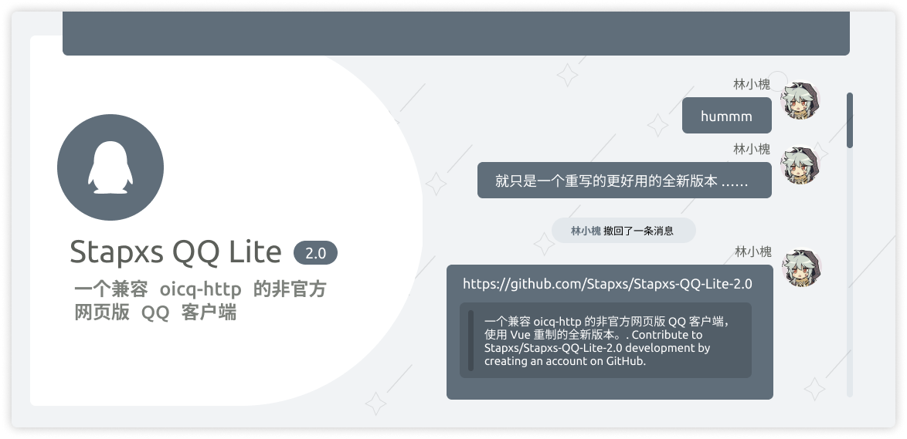
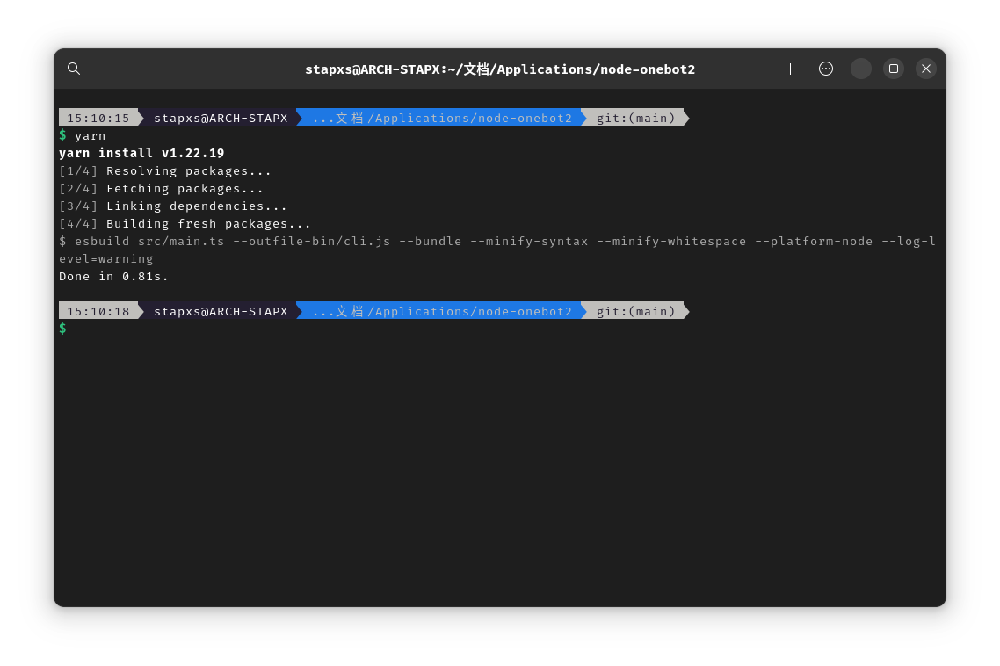
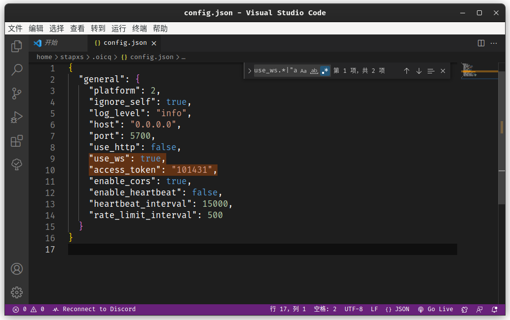
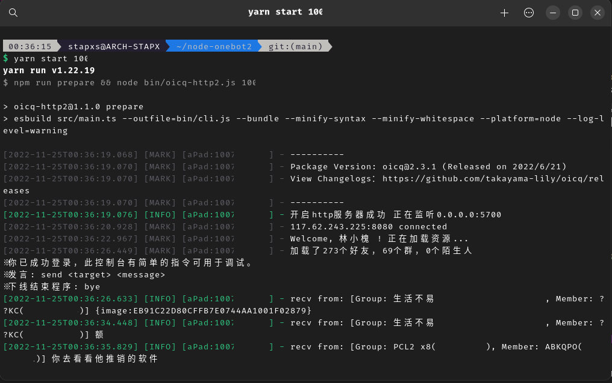
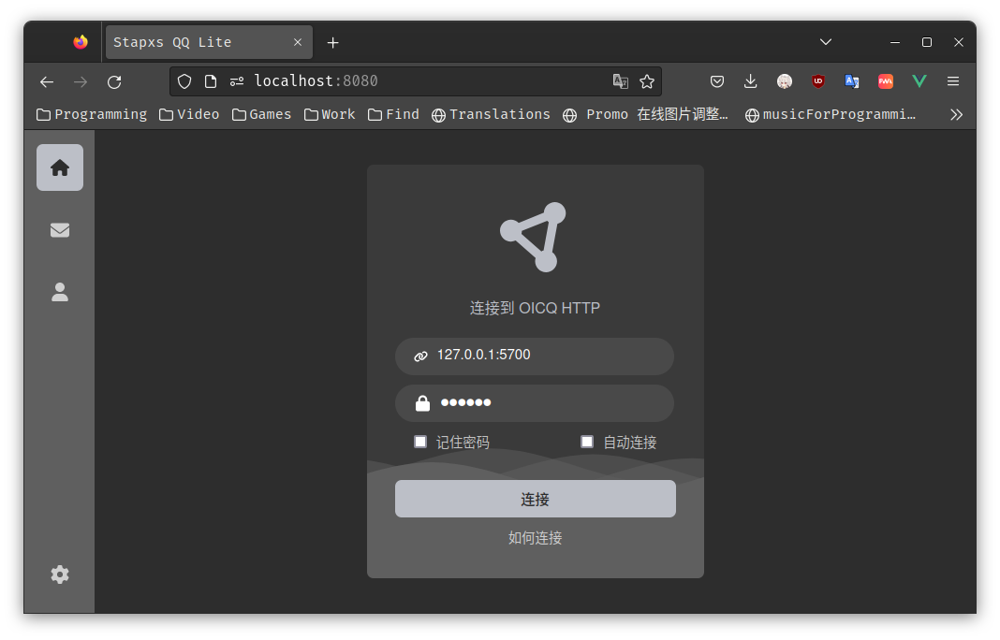
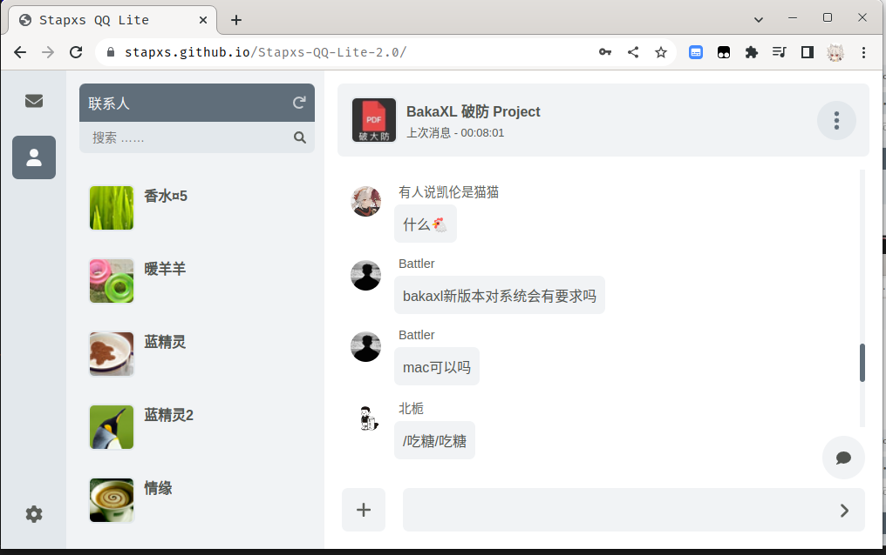
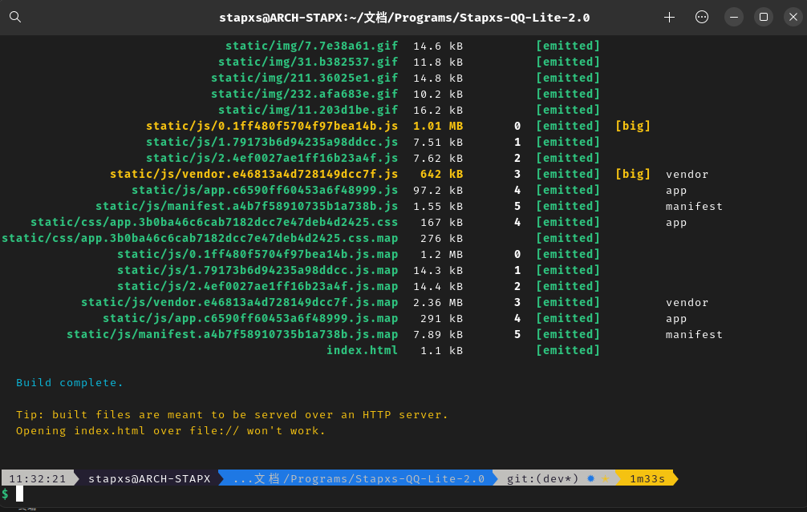

# stapxs-qq-lite

简体中文 | [English (US)](README/en_US.md)

<br>
<br>

[](https://github.com/Stapxs/Stapxs-QQ-Lite)



<div align="center">
    <h1>Stapxs QQ Lite 2.0</h1>
    <h3>这是一个兼容 oicq-http2 的非官方网页版 QQ 客户端</h3>
    <h3>使用 Vue 重新编写的全新版本</h3><br>
    <strong>本网页应用仅供学习交流使用，请勿用于其他用途</strong><br>
    <strong>版权争议请提出 issue 协商</strong>
</div>

## 快速使用
### 访问应用 - Github Pages
本仓库开启了 GitHub Pages, 所有向主分支提交的代码将会自动构建并发布。你可以直接访问 [这儿](https://stapxs.github.io/Stapxs-QQ-Lite-2.0) 来使用已经构建并部署的页面。

### 运行服务 - oicq2-http
Stapxs QQ Lite 需要一个 QQ Bot 来支持功能，目前 2.0 版本只支持定制的 oicq-http2 克隆版本，你可以在 [这个仓库](https://github.com/Tim-Paik/oicq-http2) 下载到它。

在开始运行服务前，请确认你的设备已经安装了 `yarn` 以用于运行，在终端（cmd、powershell、zsh 等）运行 `yarn -v` 来确认安装。

如果一切没问题，那么将终端转到 oicq 的目录下，开始运行 Bot 服务。

- 更新依赖
    
    运行 `yarn` 指令， yarn 将会为仓库进行初始化安装运行所需要的依赖：

    

- 配置设置文件

    在 oicq 的目录下有一个示例的设置文件 `config.json`，你可以修改它来配置相关设置，你需要保证使用 Websocket 的选项是打开的，并且为了安全性需要设置连接密钥：

    

    完成修改后把它放置到用户目录下的 `.oicq` 文件夹里，Windows 用户应该为：`C://User/[name]/.oicq`，Linux 用户则是：`/home/[name]/.oicq`，如果文件夹不存在请自行创建。

- 启动服务

    准备工作都完成了。下面回到终端，运行指令 `yarn start [QQ]` 启动服务：

    

    如果没什么问题的话， oicq-http2 应该会像上面这样完成启动，就快完成了！

- 连接服务

    回到应用页面，输入地址和密钥连接服务，大功告成！

    

    
    

## 其他提醒

### 关于不安全连接
- 当使用 https 页面连接 ws 服务（反之相同）的情况下，连接将会失败；这是由于其中某一者是不安全的。在这种情况下，你可以选择将 ws 提升为 wss 或者将 https 降级为 http（不安全）来解决问题，此处不提供解决方案。[Stapxs-QQ-Lite#32](https://github.com/Stapxs/Stapxs-QQ-Lite/issues/32)

## 更多问题

### 我能使用其他 QQ Http Bot 吗

- 如果它兼容 [OneBot 11 协议](<https://github.com/botuniverse/onebot-11>), 你可以尝试连接它, 但是由于消息体格式和接口扩展的差异，大部分情况下都不能完全正常使用。
- 以下是已兼容的 Bot:

    - [oicq http v2](https://github.com/Tim-Paik/oicq-http2)：完全兼容

- 以下是计划兼容的 Bot：

    - [oicq http v1](https://github.com/takayama-lily/oicq/tree/master/http-api)：完全兼容计划
    - [go-cqhttp](https://github.com/Mrs4s/go-cqhttp)：完全兼容计划

### 使用 Bot 是否有风险

- 如果你使用的是 oicq-http, 可以查看此处了解 [使用风险](<https://github.com/takayama-lily/oicq/wiki/98.%E5%85%B3%E4%BA%8E%E8%B4%A6%E5%8F%B7%E5%86%BB%E7%BB%93%E5%92%8C%E9%A3%8E%E6%8E%A7>), 如果你尝试使用其他 QQ Bot (参见上一条问题), 请自行参考它的文档。

### 我遇到了问题

- 如果有什么奇奇怪怪的问题, 欢迎发起 [issue](<https://github.com/Stapxs/Stapxs-QQ-Lite/issues>) 询问! 如果有什么 BUG 和优化建议也可以哦! 

## 构建应用
Stapxs QQ Lite 2.0 是一个基于 Vue 的单页应用，这意味着如果你想自行部署服务需要进行构建，你可以参考下面的 bash 进行构建：

注意。在正式构建前，如果你的网站运作目录并不在根域名下，你需要修改（或增加）项目根目录下 `vue.config.js` 内导出的 `publicPath` 字段的值，它代表着最终你会运行在的目录，比如它在现在是 `/Stapxs-QQ-Lite-2.0/`；如果你本来就运行在根目录下，可以直接删去它。

如果你想使用 Github Action 自动构建本项目，可以直接参考本项目的自动构建配置，它在 [这儿](.github/workflows//vue-build.yml)。

``` bash
# 安装依赖
yarn install
# 运行热重载开发模式在本机 8080 端口
yarn serve
# 构建应用
yarn build
# 代码检查
yarn lint
```

\* 你可以查看文档了解构建流程详情 [vue-cli 文档](https://cli.vuejs.org/config/)。

这是构建的一个例子：



## 鸣谢
<a href="https://github.com/Logic-Accepted"></a>
<a href="https://github.com/doodlehuang"></a>
